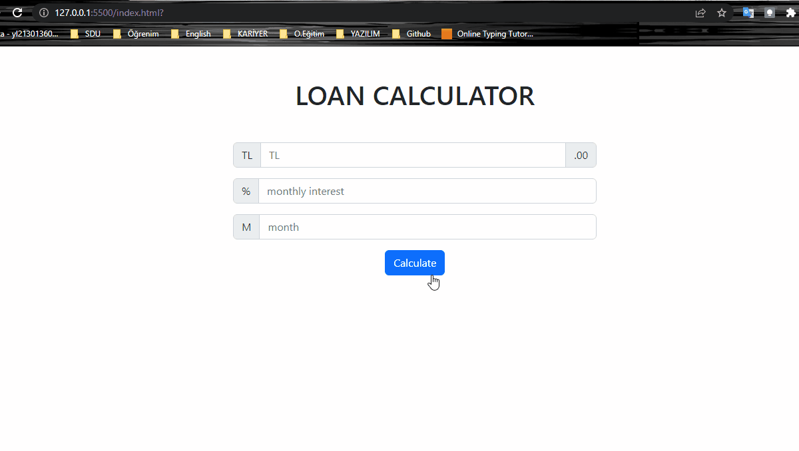

# LOAN CALCULATOR PROJECT
---
- After entering principal, monthly interest, and month, you can calculate monthly payment, total payment, and total interest
- My own country's interest calculating formula was used in this project.

---


## The Credit Calculater Function

```
const calculateCredit = (principal, interestRate, month, isHomeCredit = false) => {
  const KKDV = 0.15;
  const BSMV = 0.15;
  const totalTax =isHomeCredit ? 0 : KKDV + BSMV;
  
  const interest = (parseFloat(interestRate) / 100) * (1+ totalTax); 
  const x = Math.pow((1+interest), month);
  const monthlyPayment = (principal * ((interest * x) / (x - 1)));
  const totalPayment = (monthlyPayment * month);
  const totalInterestPayment = ((monthlyPayment * month) -principal)
  return {
    monthlyPayment:monthlyPayment.toFixed(2),
    totalPayment:totalPayment.toFixed(2),
    totalInterestPayment:totalInterestPayment.toFixed(2)
  }
}

const result = calculateCredit(148000,3.99,12)
```